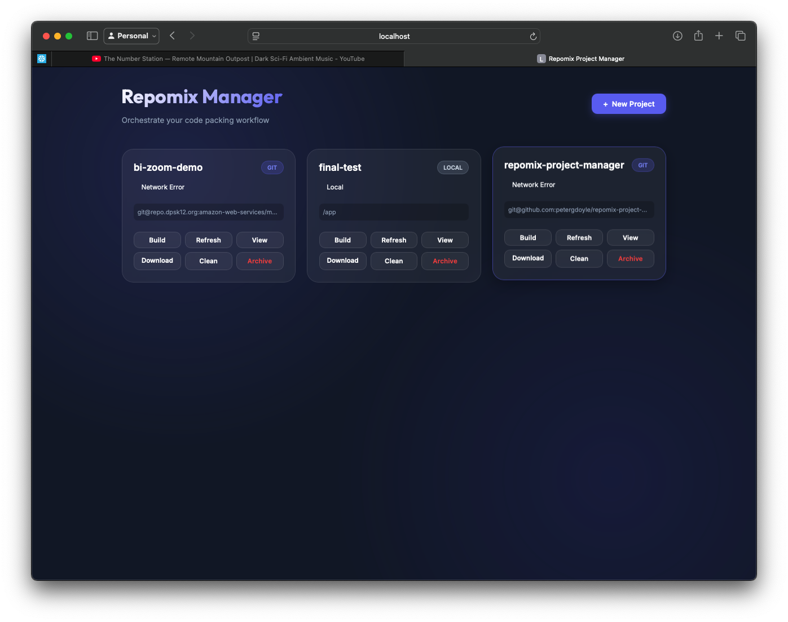

# Repomix Code Inspector

A tool to manage multiple `repomix` configurations, pack them on demand, and easily share context with LLMs.

> **🎉 What's New?** Check out the [RELEASE_SUMMARY.md](RELEASE_SUMMARY.md) for details on the new Premium Web UI, Docker containerization, and cross-browser download support!

## Features
- **Project Management**: Create and store configurations for different repositories.
- **Git Support**: Automatically clones or pulls remote repositories before running repomix.
- **Local Support**: Point to any local directory on your machine.
- **Configurable**: Each project has its own `repomix-config.yaml`.

## Getting Started

### 1. Setup Environment
```bash
make env
```
This will create a virtual environment, install Python dependencies, and install `repomix` via Homebrew (on macOS).

### 2. Create a Project
```bash
make project
```
Follow the prompts to enter a project name and source (URL or path).

### 3. Build a Project
```bash
make build NAME=my-project
```
This will fetch the source and run repomix. The output will be in `projects/my-project/outputs/`.

### 4. Clean a Project
```bash
make clean NAME=my-project
```

### 5. Archive a Project
```bash
make archive NAME=my-project
```
Zips the project config and outputs into the `archive/` folder and removes it from `projects/`.

## Sample Project
This repository includes a sample project configuration for itself! You can run it to see how the tool works immediately:

```bash
make build NAME=repomix-project-manager
```

This will clone this repository into `repos/repomix-project-manager` and generate a packed markdown file in `projects/repomix-project-manager/outputs/repomix-output.md`. This is a great way to test new features or verify your setup.

## Web Interface
You can also manage your projects through a modern web dashboard:

```bash
make web
```

This will start a FastAPI server at `http://localhost:8000`. The interface allows you to:
- **Monitor**: See the status of all your projects (Fresh, Need Refresh, etc.)
- **Action**: Build, Refresh, and Clean projects with a single click.
- **Preview**: Open and view the generated repomix outputs directly in your browser.
- **Create**: Add new projects via a guided modal.



## Docker Usage
You can run the web interface in a Docker container to ensure a consistent environment:

1. **Build the image**:
   ```bash
   make docker-build
   ```

2. **Run the container**:
   ```bash
   make docker-run
   ```
   This will start the server on `http://localhost:8000`. It automatically mounts your local `projects/`, `repos/`, and `archive/` folders, so changes made in the web UI are reflected on your host machine (and vice-versa). It also mounts your `~/.ssh` directory (read-only) to allow Git SSH operations.

3. **Stop the container**:
   ```bash
   make docker-stop
   ```

4. **Restart (Stop, Rebuild, Run)**:
   ```bash
   make docker-restart
   ```

## Acknowledgements

A huge thanks to **[yamadashy](https://github.com/yamadashy)** for creating and maintaining **[repomix](https://github.com/yamadashy/repomix)** — the fantastic open-source tool that powers the core of this project. 🎉

Repomix does the heavy lifting of packing entire codebases into a single, structured file that LLMs can digest effortlessly. It's beautifully simple, incredibly useful, and is exactly the kind of tool that makes working with AI on real codebases a joy. If you find this project useful, please go give repomix a ⭐ on GitHub — it absolutely deserves it!

> *"Pack your codebase into a single AI-friendly file."* — [repomix](https://github.com/yamadashy/repomix)
